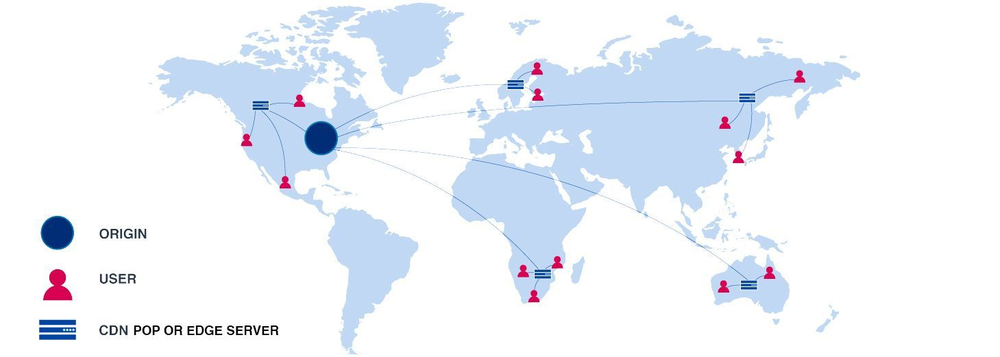

#### AWS Support Model
|   | Basic | Developer | Business | Enterprise |
|---| ----- | --------- | -------- | ---------- |
| Cost | FREE | $29/month | $100/month | $15,000/month |
| Tech Support| None | Email during business hours| 24 x 7 email, chat & phone | 24 x 7 email, chat & phone |
| TAM (Technical Account Manager) | No | No | No | Yes |
| Who can open cases? | None | 1 person/unlimited cases | Unlimited contacts/unlimited cases | Unlimited contacts/unlimited cases|
| Case Severity/Response Times | None | General guidance: < 24 business hours| General guidance: < 24 hours | Genreal guidance: < 24 hours|
| |  | System impaired: < 12 business hours | System impaired: < 12 hours | System impaired: < 12 hours |
| |  | | Production system impaired: < 4 hours | Production system impaired: < 4 hours |
| | | | Production system down: < 1 hour| Production system down: < 1 hour |
| | | | | Business-critical system down: < 15 minutes |
- Which support plan has a TAM?
- Which support plan only has email technical support?

#### AWS Pricing Model
	- AWS Pricing Whitepaper: 
		- https://docs.aws.amazon.com/whitepapers/latest/how-aws-pricing-works/how-aws-pricing-works.pdf
	- Capex vs Opex
		- Capital Expenditure - Pay up front, fixed sunk cost
		- Operational Expenditure - Pay as you go, and pay for what you use
	- AWS pricing philosophy
		- Pay as you go
		- Pay for what you use
		- Pay less as you use more
		- Pay even less when you reserve capacity
	- Key principles and best practices
		- Understand the fundamentals of pricing
		- Start early with cost optimization
		- Maximize the power of flexibility
		- Use the right pricing model for the job
	- Understand the fundamentals of pricing
		- Compute
		- Storage
		- Data out bound
	- Start early with cost optimization
		- Put cost controls in place before your environment grows out of control
	- Maximize the power of flexibility
		- Pay for what your need when you need
		- Turn off things you are not using
	- Use the right pricing model for the job
		- On demand, reserved, spot, dedicated host
		- Free account services
			- Amazon VPC
			- Elastic Beanstalk
			- CloudFormation
			- IAM
			- Auto Scaling
			- Opsworks
			- Consolidated Billing
	- EC2 pricing
		- Clock hour of server time
		- Instance type
		- Pricing model 
		- Number of instances
		- Load balancing
		- Detailed monitoring
		- Auto scaling
		- Elastic IP addess
		- OS charges (eg. Windows)
	- Lambda pricing
		- Number of requests (1 million per month free)
		- $0.20 per 1 million after
		- Duration cost - how long compute times take
		- Data transfer cost - lambda moving data to other services
	- EBS pricing
		- Volumes (per GB)
		- Snapshots (per GB)
		- Data Transfer 
	- S3 pricing
		- Storage class (Standard, IA, 1 AZ IA etc)
		- Storage size
		- Requests (GET PUT COPY)
		- Data transfer
		- Glacier pricing 
			- Retrival time based, longer = cheaper
	-  Snowball pricing
		- Service fee per job
			- 50 TB: $200
			- 80 TB: $250
		- Daily charge
			- First 10 free, $15 per day after
		- Data transfer
			- Free to transfer data in S3, not if transfering data out
	- RDS pricing
		- Server time (compute time)
		- Database characteristics (MS SQL vs MySQL)
		- Database purchase type
		- Number of instances
		- Provisioned storage
		- Additional storage (for backups)
		- Requests
		- Deployment type (Muti-AZ)
		- Data transfer
	- DynamoDB pricing
		- Provisioned throughput (write)
		- Provisioned throughput (read)
		- Indexed data storage
	- Cloud Front
		- Traffic Distribution
		- Number of requests
		- Data transfer out

#### IAM Best Practice
	- Do not use your root account to login
	- Always enable MFA when possible
	- One user should use one real human - do not have phantom users
	- Use roles to access different AWS services
	- Always place users to groups and assign the required roles to groups
	- Have strong password policy
	- Use IAM credential report to audit user permissions

#### S3 - Simple Storage Service
	- S3 is object based, key/value pair storage solution
	- File stored are in different locations (physical servers)
	- File size can be from 0 bytes to 5 TB, unlimited storage
	- Bucket names are globally unique
	- When file upload to a bucket is successful, HTTP 200 will be received
	- Read after write consistency for PUTS of new objects
	- Eventual consistency for overwrite PUTS and DELTES
	- AWS guarantees for S3
		- S3 platform is built 99.99% availability
		- but AWS gurantees 99.9% availability
		- 99.999999999% durability for S3 data (11 9s)
	- Features
		- Tiered storage
		- Lifecycle management
		- Versioning
		- Encryption
		- Secure data using Access Control Lists (ACL) and Bucket Polices
	- Storage classes - https://aws.amazon.com/s3/storage-classes/
		- S3 Standard - 99.99% availability, 11 9 durability, can sustain 2 facility failure
		- S3 IA (Infrequently Accessed) - lower fees than standard, but charged when accessing data
		- S3 one zone IA - IA with lower cost but no data replication across different AZs
		- S3 Intellegent Tiering - moves your data based on your usage pattern
		- S3 Glacier - for data archiving, takes minutes or hours to access (configurable), lower cost
		- S3 Glacier Deep Archive - lowest cost, but data retrieval time takes 12 hours or more
	- Charges
		- Storage
		- Requests
		- Storage management pricing
		- Data transfer pricing
		- Transfer acceleration
		- Cross region replication

### EC2 - Elastic Cloud Compute - Virtual Machine
	- Pricing model
		- On Demand - pay a fixed rate by the second with no commitment
		- Reserved - contract terms of 1 or 3 years, discount from on demand
			- Standard Reserved Instances - Up to 75% off on demand instances, instance type specific
			- Convertable Reserved Instances - Up to 54% off on demand instances, can convert between different instance types
			- Scheduled Reserved Instances - Reserve instances based on time windows to match capacity requirements
		- Spot - bid on a price, you will get the server when the price drops below your bid
			- If a spot instance is terminated by AWS, you don't have to pay for full hour. If you terminate a spot instance, you pay for the full hour
		- Dedicated hosts - physical EC2 server dedicated for your use only
	- Usange
		- On Demand
			- For users that want flexiablity without up front payment
			- Good for applications that have unpredicatble usage
			- Useful for testing instances
		- Reserved
			- Good for applications that are in steady state or predicatble usage
			- The longer the reserved period, the better the pricing
		- Spot
			- Useful for application that have flexible start and end times
			- Good for application that are only feasible at very low compute prices (ex. DNA sequencing applications)
		- Dedicated hosts
			- Needed for regulatory requirements that disallow the use of multi-tenant virtualization (ex. government applications)
			- Good for software that have licensing requirments that do not support multi-tenancy
			- Can be purchased on demand as well as reserved
	- Instance types
		- F1, I3, G4, H1, T4g, D2, R6g, M6g, C6g, P3, X1e, Z1D, A1, U-12TB1
		- T4g - T class - lowest cost general purpose - web server/small DBs
		- M6g - M class - general purpose, higher specs than T class - application servers
		- C6g - C class - compute optimized, better CPU for CPU intensive apps
		- R6g - R class - memory optimized, better RAM for memory intensive apps

### EBS - Elastic Block Storage
	- SSD
		- General Purpose SSD (GP2) - blanaces prices and perforamce for wide variety of workloads
		- Provisioned IOPS SSD (IO1) - highest performance SSD for low-latency and high-throughput
	- Magnetic
		- Throughput Optimized HDD (ST1) - low cost HDD designed for frequencly accessed workloads
		- Cold HDD (SC1) - lowest cost HDD volume for less frequently accessed data

### CloudFront
	- AWS' content delivery network (CDN)

	- Edge Locations - where content will be cached
	- Origin - The origin of the file for distribution
	- How does CloudFront work
		1. First user queries edge location
		2. If content doesn't already exists, CloudFront will copy content from orgin to edge location
		3. Second user queries the same content, since edge location already have it, it will get directly from edge location
	- Content will be cached for a set amount of time, and that time is called TTL (Time to Live), usually 48 hours in seconds (86400)
	
### Load Balancers
	- Types
		- Application
		- Network
		- Classic
	- Application Load balancer
		- Operates on layer 7 
		- Can make intellgent routing decisions
	- Network Load balancer
		- Fast performance
		- Can have static IP addresses
	- Classic
		- Old and will be phased out

### Route 53
	- AWS' DNS Service
	- Features
		- DNS Management 
		- Traffic Management
		- Availability Monitoring
		- Domain Registration

### Database
	- RDS - Relational Database Service
		- Database types
			- MS SQL Server
			- Oracle
			- MySQL Server
			- PostgreSQL
			- Aurora - created by AWS
			- MariaDB
	- Key features
		- Multi-AZ - for disaster recover
		- Read replicas - for performance, up to 5 copies
	- DynamoDB - Non-relational Database created by AWS
	- OLTP vs OLAP
		- OnLine Trasactions Processing - used for basic database queries
			- Example: give me user with id 22312
		- OnLine Analitics Processing - more complex queries, used for Business Intellengenc (BI) 
			- Example: give me earning of product xyz in the Europe market for Q2 and compare with Q1
			- Data warehousing used to run OLAP queries outside of production database
			- Redshift - AWS's data warehouse solution
	- ElastiCache - used to cache common queries from database for better performance 
		- Example: Amazon's home page can be visited by thousands of users any given moment, it would be better to cache that result instead of querying the database
		- Memcached and Redis are the two different solutions for ElastiCache
