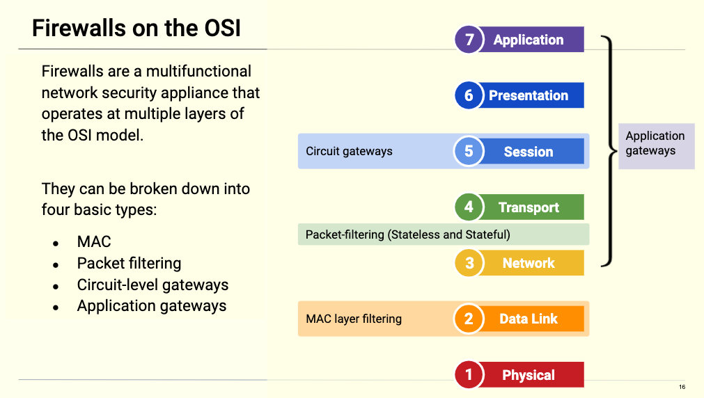

# Firewalls
## Firewall Summary

- Firewall are modes of protection provided to an organization or user, that analyze data leaving or entering a network.
- Packet filter firewalls operate between Layer 3 and Layer 4 of the OSI model.
  - These protect a network by examining source and destination IP address, port number, and packet type, without opening the packet to inspect its contents.
- Circuit-level firewalls operate at Layer 5 of the OSI model. 
  - These look at the header of a packet only. Once the circuit is allowed to establish an end to end connection, all data is tunneled between the parties.
- Stateful firewalls operate at Layer 7 of the OSI model.  
  - These use a combination of TCP handshake verification and packet inspection technology to create a greater level of protection.
- Application or proxy firewalls operate at layer 3 through layer 7 of the OSI model. 
  - These inspect the contents of the packet, which can involve authentication and encryption.
- Firewalls are not immune to attacks.

## Firewall Types and Architectures

A firewall is a multifunctional network security appliance that operates on multiple layers of the OSI. These firewalls can be broken down into four basic types:

- MAC layer
- Packet filtering
- Circuit-level gateways
- Application gateways

 

MAC Layer Filtering Firewall

Each device on a network has a unique hardware identification called a Media Access Control (MAC) address. This unique hardware ID is what allows all devices to communicate.

As its name suggests, this firewall operates at Layer 2 of the OSI model and filters based on source and destination MAC addresses.

- MAC layer firewalls, also referred to as MAC filtering, are commonly found on Wi-Fi systems.

- This firewall will first compare a device's MAC address against a statically approved list of MAC addresses. If there is a match, all traffic will be forwarded.

- One advantage of MAC layer firewalls is that they may help secure a network from novice attackers.

- One disadvantage is that this security control can easily be bypassed by MAC spoofing, the process of changing a MAC address to match that of another, typically one that is already allowed in the firewall.

### Stateless Firewall

Stateless firewalls, also known as **packet-filtering** firewalls, operate at Layer 3 and 4 of the OSI model. These firewalls statically evaluate the contents of packets and do not keep track of the state of a network connection (aka Stateless).

Packet-filtering firewalls examine the network and transport headers closely for the following information:

- **Source and destination IP address:** Source IP address is from a device that initiates a communication. The destination IP address is the intended receiving device.

- **Source and destination port information:**  When combined with an IP address, ports enable applications that are running on TCP/IP network hosts to communicate.

- **IP (Internet Protocol):** Responsible for addressing devices on a network and ensuring the delivery of data from a source to a destination.

  - This delivery can be through connection-oriented TCP, meaning a successful three-way handshake must occur before the transmission of data.

  - This delivery can also be through connectionless UDP (User Datagram Protocol), which doesn't rely on a three-way handshake.

- **Ingress/egress interface:** Interface of data being received (ingress) and data being sent out (egress).

Packet-filtering firewalls are the oldest type of firewall architecture.

- It creates checkpoints within a router or switch and examines packet data as it is transported through a network interface.

- If the information contained within the packet does not pass this inspection process, it is dropped.

- This kind of filtering works by inspecting the contents of each individual packet. Stateless firewalls do not consider the state of the connection as a whole.

- One advantage is that stateless firewalls are not resource intensive, meaning they are low-cost and do not significantly impact system performance.

- One disadvantage is that they are easy to subvert compared to more robust firewalls. They are vulnerable to IP spoofing and do not support custom-based rule sets.

### Stateful Firewall

Stateful firewalls operate at Layer 3 and 4 of the OSI model.

- It uses a combination of TCP handshake verification and packet inspection technology to create stronger protection than either of the two previously discussed firewalls.

Rather than looking at individual packets, stateful firewalls examine the connection as a whole, looking at whole streams of packets.

This allows stateful firewalls to detect more information than stateless firewalls can. For example, they can determine:

  - If a packet is trying to establish a new connection. This is called a **NEW** state.

  - If a packet is part of an existing connection. This is called an **ESTABLISHED** state.

  - If a packet is not opening a new connection or belongs to an existing one. This is considered a **Rogue** packet.

Since stateful firewalls understand the context of the entire data stream, they can determine which application layer protocols are in use. However, they cannot actually understand application layer protocols, so they can't determine what the underlying traffic is doing.

- For example: Stateful firewalls can identify that a connection is using HTTP, but cannot identify if the connection is being used to request an HTML file or a PNG image.

- One advantage of stateful firewalls is that they offer transparent mode, which allows direct connections between clients and servers.

  - They can also implement protocol specific algorithms and complex models to ensure more secure connections.

- One disadvantage is that they are resource-intensive systems that can slow the transmission of legitimate packets when compared to other solutions. If exploited, this can cause a DoS condition.

### Circuit-Level Gateway Firewall

Circuit-level firewalls operate at Layer 5 of the OSI model.

- Circuit-level gateways determine the legitimacy of TCP connections by observing the handshake process between packets.

Once the circuit is allowed to establish an end-to-end connection, all data is tunneled between the parties.

- Circuit-level gateways work by verifying the three-way TCP handshake. TCP handshake checks are designed to ensure that session packets are from legitimate sources.

- Circuit-level gateways use the following information to determine the legitimacy of network connections before forwarding traffic:

  - Unique session identifier
  - State of the connection (Handshake established, closed)
  - Sequencing information

- One advantage of circuit-level gateways is that they quickly and easily approve or deny traffic without consuming a significant amount of computing resources. They are also relatively inexpensive and provide anonymity to the private network.

- One disadvantage is that they do not check the contents of the packet itself.

  - If a packet contains malware but has the correct TCP handshake information, the data is allowed to pass through.

  - This is why using circuit-level gateways are not capable of fully protecting a network on their own.

### Application or Proxy Firewalls

Application or proxy firewalls, often referred to as "application-level gateways" , operate at Layers 3 through 7 of the OSI model.

  - This firewall actually inspects the contents of the packet, including authentication and encryption components.

Proxy firewalls use deep packet inspection and stateful inspection to determine if incoming traffic is safe or harmful.

- Proxy firewalls intercept all traffic on its way to its final destination, without the data source knowing. A connection is established to the proxy firewall, which inspects the traffic and forwards it if it's determined to be safe, or drops it if it's determined to be malicious.

Proxy firewalls create an extra layer of protection between the traffic source and its destination behind the network by obscuring the destination from the source creating an additional layer of anonymity and protection for the network.

- One advantage is that it's more secure than other implementations and provides simple log and file audit management for incoming traffic.

- One disadvantage is that it is resource intensive, requiring robust modern hardware and higher costs. 
